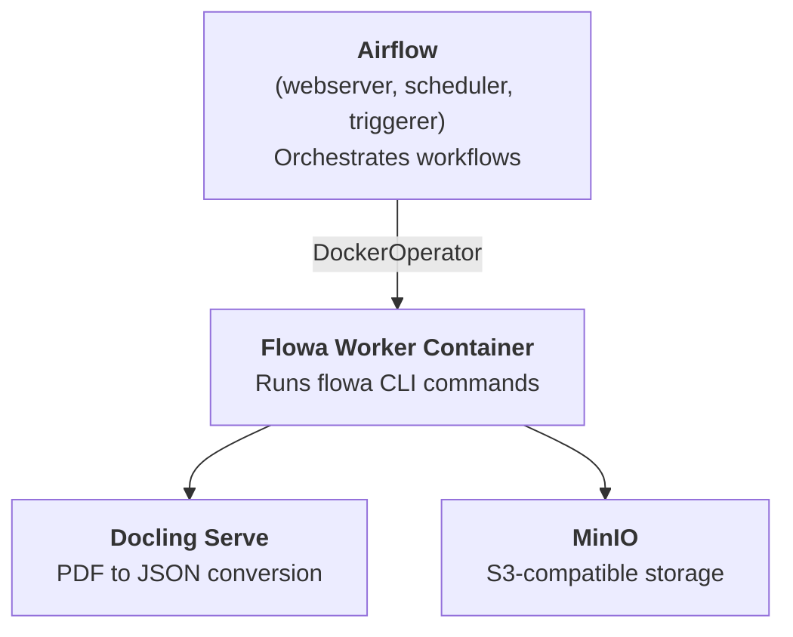

# Flowa

Variant literature assessment pipeline with AI extraction.

## Architecture

Flowa runs as an Airflow DAG that orchestrates paper processing via Docker containers.

## Configuration

When running as an Airflow DAG, configuration is stored in **Airflow Variables**. The CLI reads configuration from **environment variables**.

### Core Variables

| Variable             | Description                                                       | Example                                                                   |
| -------------------- | ----------------------------------------------------------------- | ------------------------------------------------------------------------- |
| `FLOWA_STORAGE_BASE` | Storage path for PDFs, extractions, results                       | `s3://bucket`, `gs://bucket`, `file:///path`                              |
| `FLOWA_MODEL`        | LLM model ([pydantic-ai format](https://ai.pydantic.dev/models/)) | `bedrock:anthropic.claude-...`, `openai:gpt-...`, `google-gla:gemini-...` |
| `FLOWA_QUERY_SOURCE` | Literature query source                                           | `litvar`, `mastermind`                                                    |

### LLM Providers

Set `FLOWA_MODEL` to one of:

- **AWS Bedrock**: `bedrock:au.anthropic.claude-opus-4-6-v1`
- **Google Gemini**: `google-gla:gemini-3-pro`
- **OpenAI**: `openai:gpt-5.2`

Provider credentials:

| Provider      | Required Variables                                                                            |
| ------------- | --------------------------------------------------------------------------------------------- |
| AWS Bedrock   | `AWS_PROFILE` + `AWS_REGION`, or `AWS_ACCESS_KEY_ID` + `AWS_SECRET_ACCESS_KEY` + `AWS_REGION` |
| Google Gemini | `GOOGLE_API_KEY`                                                                              |
| OpenAI        | `OPENAI_API_KEY`                                                                              |

### Storage Backends

| Backend               | `FLOWA_STORAGE_BASE` | Additional Variables                                          |
| --------------------- | -------------------- | ------------------------------------------------------------- |
| AWS S3                | `s3://bucket-name`   | AWS credentials (see above)                                   |
| Google Cloud Storage  | `gs://bucket-name`   | `GOOGLE_APPLICATION_CREDENTIALS` or workload identity         |
| S3-compatible (MinIO) | `s3://bucket-name`   | `FSSPEC_S3_ENDPOINT_URL`, `FSSPEC_S3_KEY`, `FSSPEC_S3_SECRET` |
| Local filesystem      | `file:///path`       | —                                                             |

## Prompt Customization

Flowa supports site-specific prompt sets for different integrations. Each prompt set is a directory under `prompts/` containing prompt templates and Pydantic schema modules.

### Configuration

| Variable           | Description                             | Default   |
| ------------------ | --------------------------------------- | --------- |
| `FLOWA_PROMPT_SET` | Name of the prompt set directory to use | `generic` |

### Prompt Set Structure

Each prompt set must contain:

```
prompts/{prompt_set}/
├── extraction_prompt.txt      # Prompt template for individual paper extraction
├── extraction_schema.py       # Pydantic model defining ExtractionResult
├── aggregate_prompt.txt       # Prompt template for cross-paper aggregation
└── aggregate_schema.py        # Pydantic model defining AggregateResult
```

### Interface Requirements

Schema modules must define Pydantic models with specific fields that Flowa's validation logic depends on:

**extraction_schema.py** must define `ExtractionResult` with:

- `evidence[].citations[].box_id` (int) - for bounding box validation

**aggregate_schema.py** must define `AggregateResult` with:

- `citations[].pmid` (int) - for paper reference validation
- `citations[].box_id` (int) - for bounding box validation

All other fields can be customized freely. See `prompts/generic/` for the default implementation.

### Creating a Custom Prompt Set

1. Create a directory under `prompts/` (e.g., `prompts/mysite/`)
2. Copy and modify the prompt templates from `prompts/generic/`
3. Create schema modules with Pydantic models satisfying the interface requirements
4. Set `FLOWA_PROMPT_SET=mysite`

### CI Integration (Injecting Prompts at Build Time)

For private prompt sets that shouldn't be in the Flowa repository:

```bash
# In your CI pipeline
git clone https://github.com/org/flowa.git
cp -r /path/to/my-prompts flowa/prompts/mysite/
docker build -t flowa-worker-mysite .
```

**Note:** Use `cp -r` to copy prompt files into the build context. Symlinks don't work because Docker copies the symlink itself, not the target, so the path becomes broken inside the container.

Then set the `FLOWA_PROMPT_SET` Airflow Variable:

```bash
docker compose exec airflow-scheduler airflow variables set FLOWA_PROMPT_SET mysite
```

## Local Development

Docker Compose setup for running Flowa with Apache Airflow 2.10.3.

### Quick Start

```bash
docker compose up -d
docker compose build flowa-worker
```

To also start a local MinIO instance (optional, use `--profile minio`):

```bash
docker compose --profile minio up -d
```

**Services:**

- Airflow UI: <http://localhost:18080> (admin/admin)
- MinIO Console: <http://localhost:9004> (admin/password) — only with `--profile minio`
- MinIO S3 API: <http://localhost:9003> — only with `--profile minio`

### Architecture



The Flowa worker containers are **decoupled** from Airflow. The DAG code configures
worker containers at runtime using Airflow Variables.

### Setting Airflow Variables

Set variables via CLI after Airflow starts:

```bash
docker compose exec airflow-scheduler airflow variables set VARIABLE_NAME "value"
```

Or use the Airflow UI: **Admin → Variables**

### Example Configurations

#### MinIO + Bedrock

Connects to a MinIO instance at `localhost:9003`. If using `--profile minio`, the bucket `flowa` is created automatically.

```bash
docker compose exec airflow-scheduler airflow variables set FLOWA_PLATFORM docker
docker compose exec airflow-scheduler airflow variables set FLOWA_STORAGE_BASE "s3://flowa"
docker compose exec airflow-scheduler airflow variables set FLOWA_MODEL "bedrock:au.anthropic.claude-opus-4-6-v1"
docker compose exec airflow-scheduler airflow variables set FLOWA_QUERY_SOURCE litvar
docker compose exec airflow-scheduler airflow variables set FSSPEC_S3_ENDPOINT_URL "http://host.docker.internal:9003"
docker compose exec airflow-scheduler airflow variables set FSSPEC_S3_KEY "admin"
docker compose exec airflow-scheduler airflow variables set FSSPEC_S3_SECRET "password"
docker compose exec airflow-scheduler airflow variables set AWS_DEFAULT_REGION "ap-southeast-2"
```

#### Local Filesystem + OpenAI

```bash
docker compose exec airflow-scheduler airflow variables set FLOWA_PLATFORM docker
docker compose exec airflow-scheduler airflow variables set FLOWA_STORAGE_BASE "file:///tmp/flowa"
docker compose exec airflow-scheduler airflow variables set FLOWA_MODEL "openai:gpt-5.2"
docker compose exec airflow-scheduler airflow variables set FLOWA_QUERY_SOURCE litvar
docker compose exec airflow-scheduler airflow variables set OPENAI_API_KEY "sk-..."
```

#### GCS + Gemini

```bash
docker compose exec airflow-scheduler airflow variables set FLOWA_PLATFORM docker
docker compose exec airflow-scheduler airflow variables set FLOWA_STORAGE_BASE "gs://your-bucket"
docker compose exec airflow-scheduler airflow variables set FLOWA_MODEL "google-gla:gemini-3-pro"
docker compose exec airflow-scheduler airflow variables set FLOWA_QUERY_SOURCE litvar
docker compose exec airflow-scheduler airflow variables set GOOGLE_API_KEY "..."
```

### Triggering DAG Runs

#### Via Airflow UI

1. Go to <http://localhost:18080/dags/flowa_assessment/grid>
2. Click the **Play** button (▶) in the top right and select **Trigger DAG w/ config**
3. Enter the required parameters as JSON:

   ```json
   {
     "variant_id": "test_variant",
     "gene": "GAA",
     "hgvs_c": "NM_000152.5:c.2238G>C"
   }
   ```

4. Click **Trigger**

The Grid view shows task status for each run. Click on a task to view logs, XCom outputs, and retry failed tasks.

#### Via REST API

```bash
curl -X POST 'http://localhost:18080/api/v1/dags/flowa_assessment/dagRuns' \
  -H 'Content-Type: application/json' \
  -u 'admin:admin' \
  -d '{
    "conf": {
      "variant_id": "test_variant",
      "gene": "GAA",
      "hgvs_c": "NM_000152.5:c.2238G>C"
    }
  }'
```

### Testing CLI Locally

Using local filesystem (outside Docker):

```bash
export FLOWA_STORAGE_BASE=file:///tmp/flowa
export FLOWA_MODEL=openai:gpt-5.2
export OPENAI_API_KEY=sk-...

uv run flowa query --variant-id test --gene GAA --hgvs-c "c.2238G>C" --source litvar
uv run flowa download --pmid 12345678
uv run flowa convert --pmid 12345678
uv run flowa extract --variant-id test --pmid 12345678
```

Using MinIO at localhost:9003:

```bash
FLOWA_STORAGE_BASE=s3://flowa \
FSSPEC_S3_ENDPOINT_URL=http://localhost:9003 \
FSSPEC_S3_KEY=admin \
FSSPEC_S3_SECRET=password \
uv run flowa convert --pmid 12345678
```

### Useful Commands

```bash
# Check for DAG import errors (run this first if DAGs aren't showing up)
docker compose exec airflow-scheduler airflow dags list-import-errors

# View logs
docker compose logs -f airflow-scheduler

# Rebuild Flowa worker image after code changes
docker compose build flowa-worker

# Run Flowa CLI directly in worker container
docker run --rm flowa-worker:latest --help

# Stop everything
docker compose down

# Stop and remove volumes (fresh start)
docker compose down -v
```

## Deployment Platforms

The DAG uses a portable operator abstraction that supports multiple deployment targets. Set `FLOWA_PLATFORM` (required) to select the platform:

| Platform     | Operator              | Use Case             |
| ------------ | --------------------- | -------------------- |
| `docker`     | DockerOperator        | Local development    |
| `ecs`        | EcsRunTaskOperator    | AWS MWAA / Fargate   |
| `kubernetes` | KubernetesPodOperator | GKE / Cloud Composer |

### Resource Profiles

Define resource profiles in `FLOWA_RESOURCE_PROFILES` to control CPU/memory allocation:

```json
{
  "default": { "cpu": "0.5", "memory": "1Gi" },
  "heavy": { "cpu": "2", "memory": "8Gi" }
}
```

The `heavy` profile is used by the `process_paper` task which runs docling for PDF conversion.

Resource limits are applied as runtime overrides (ECS Fargate task overrides / K8s pod requests+limits).

### ECS Configuration

Set `FLOWA_ECS_CONFIG` (required when `FLOWA_PLATFORM=ecs`):

```json
{
  "cluster": "flowa-cluster",
  "task_definition": "flowa-worker",
  "network_configuration": {
    "awsvpcConfiguration": {
      "subnets": ["subnet-xxx"],
      "securityGroups": ["sg-xxx"],
      "assignPublicIp": "DISABLED"
    }
  },
  "awslogs_group": "/ecs/flowa",
  "awslogs_region": "ap-southeast-2",
  "awslogs_stream_prefix": "worker/flowa-worker"
}
```

The `awslogs_stream_prefix` must include the container name because CloudWatch names streams as `{task_def_prefix}/{container_name}/{task_id}`, but Airflow looks for `{awslogs_stream_prefix}/{task_id}`.

**Task Definition Requirements:**

- The Task Definition specifies the **container image** (e.g., ECR URL). `FLOWA_WORKER_IMAGE` is not used for ECS; update the Task Definition to change the image.
- CPU/memory must accommodate your largest resource profile. Fargate allows overriding these values down but not up beyond the task definition limits. Since the `heavy` profile requires 2 vCPU / 8Gi, register your task definition with at least these values.

### Kubernetes / Cloud Composer Configuration

Set `FLOWA_K8S_CONFIG` (optional, has defaults):

```json
{
  "namespace": "flowa",
  "service_account_name": "flowa-worker",
  "in_cluster": true
}
```

**Google Cloud Composer specifics:**

- **`in_cluster`**: Always `true` - Composer runs inside GKE, so pods use the cluster's internal API.
- **`namespace`**: Can be Composer's namespace (e.g., `composer-2-x-x-airflow-2-x`) or a dedicated namespace you create. Using a separate namespace is cleaner for resource quotas and RBAC.
- **`service_account_name`**: A Kubernetes service account (not GCP service account). Use [Workload Identity](https://cloud.google.com/kubernetes-engine/docs/how-to/workload-identity) to bind it to a GCP service account for access to GCS, Secret Manager, etc.
- **Image**: Use Artifact Registry (`REGION-docker.pkg.dev/PROJECT/REPO/flowa-worker:TAG`). Grant the K8s service account's bound GCP service account the `roles/artifactregistry.reader` role.

Example Cloud Composer config:

```json
{
  "namespace": "flowa-workloads",
  "service_account_name": "flowa-worker-ksa",
  "in_cluster": true,
  "startup_timeout_seconds": 600,
  "image_pull_policy": "Always"
}
```

To set up Workload Identity for the worker pods:

```bash
# Create K8s service account
kubectl create serviceaccount flowa-worker-ksa -n flowa-workloads

# Bind to GCP service account
gcloud iam service-accounts add-iam-policy-binding \
  flowa-worker-gsa@PROJECT.iam.gserviceaccount.com \
  --role roles/iam.workloadIdentityUser \
  --member "serviceAccount:PROJECT.svc.id.goog[flowa-workloads/flowa-worker-ksa]"

# Annotate K8s SA
kubectl annotate serviceaccount flowa-worker-ksa \
  -n flowa-workloads \
  iam.gke.io/gcp-service-account=flowa-worker-gsa@PROJECT.iam.gserviceaccount.com
```

### Worker Image

Set `FLOWA_WORKER_IMAGE` to your container registry URL (Docker and Kubernetes only; ECS uses the image from the Task Definition):

- Local: `flowa-worker:latest` (default)
- GKE: `gcr.io/project/flowa-worker:latest`
