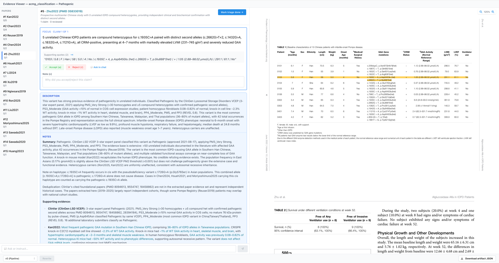

# Flowa

Variant literature assessment pipeline with AI extraction.



*Each citation in the aggregated assessment links back to the exact highlighted quote in the source paper's PDF.*

## Architecture

Flowa is a single async pipeline that processes genetic variant literature:

```text
query → download → convert → extract → aggregate
```

- **Query**: Search Mastermind/LitVar for papers, resolve PMIDs to DOIs via PubMed
- **Download**: Fetch PDFs from PMC (main article + supplements)
- **Convert**: PDF → Markdown via [anchorite](https://github.com/populationgenomics/anchorite) (LLM-based conversion)
- **Extract**: Per-paper evidence extraction via LLM
- **Aggregate**: Cross-paper synthesis via LLM, resolving citation quotes to PDF bounding boxes via anchorite

Papers are processed in parallel. LLM concurrency is controlled via `--llm-concurrency`.

## Installation

Install from PyPI, opting into the provider extras you need (one of `anthropic`, `bedrock`, `google`, `openai`):

```bash
pip install 'flowapy[bedrock]==0.1.0'
# or
uv pip install 'flowapy[bedrock,anthropic]==0.1.0'
```

The `flowa` CLI is exposed as a console script. See [Configuration](#configuration) for credentials and storage setup.

## Usage

```bash
# Full pipeline
flowa run --variant-id VAR123 --gene GAA --hgvs-c "NM_000152.5:c.2238G>C" --source litvar

# Individual steps (for debugging)
flowa query --variant-id VAR123 --gene GAA --hgvs-c "NM_000152.5:c.2238G>C" --source litvar
flowa download --doi '10.1038/s41586-020-2308-7'
flowa convert --doi '10.1038/s41586-020-2308-7'
flowa extract --variant-id VAR123 --doi '10.1038/s41586-020-2308-7'
flowa aggregate --variant-id VAR123
```

## Configuration

### Environment Variables

| Variable                | Description                                                       | Example                                            |
| ----------------------- | ----------------------------------------------------------------- | -------------------------------------------------- |
| `FLOWA_STORAGE_BASE`    | Storage path for PDFs, extractions, results                       | `s3://bucket`, `gs://bucket`, `file:///path`        |
| `FLOWA_CONVERT_MODEL`   | LLM for PDF→Markdown conversion (anchorite)                     | `bedrock:au.anthropic.claude-sonnet-4-6`        |
| `FLOWA_EXTRACTION_MODEL`| LLM for extraction and aggregation                               | `bedrock:au.anthropic.claude-opus-4-6`          |

### LLM Providers

Models use [pydantic-ai format](https://ai.pydantic.dev/models/). Examples:

- **AWS Bedrock**: `bedrock:au.anthropic.claude-sonnet-4-6` (convert), `bedrock:au.anthropic.claude-opus-4-6` (extraction)
- **Google Gemini**: `google-gla:gemini-3-pro`
- **OpenAI**: `openai:gpt-5.2`

Provider credentials:

| Provider      | Required Variables                                                                            |
| ------------- | --------------------------------------------------------------------------------------------- |
| AWS Bedrock   | `AWS_PROFILE` + `AWS_REGION`, or `AWS_ACCESS_KEY_ID` + `AWS_SECRET_ACCESS_KEY` + `AWS_REGION` |
| Google Gemini | `GOOGLE_API_KEY`                                                                              |
| OpenAI        | `OPENAI_API_KEY`                                                                              |

### Storage Backends

| Backend               | `FLOWA_STORAGE_BASE` | Additional Variables                                          |
| --------------------- | -------------------- | ------------------------------------------------------------- |
| AWS S3                | `s3://bucket-name`   | AWS credentials (see above)                                   |
| Google Cloud Storage  | `gs://bucket-name`   | `GOOGLE_APPLICATION_CREDENTIALS` or workload identity         |
| S3-compatible (MinIO) | `s3://bucket-name`   | `FSSPEC_S3_ENDPOINT_URL`, `FSSPEC_S3_KEY`, `FSSPEC_S3_SECRET` |
| Local filesystem      | `file:///path`       | —                                                             |

## Prompt Customization

Flowa supports site-specific prompt sets. Each prompt set is a directory under `prompts/` containing prompt templates and Pydantic schema modules.

| Variable           | Description                             | Default   |
| ------------------ | --------------------------------------- | --------- |
| `FLOWA_PROMPT_SET` | Name of the prompt set directory to use | `generic` |

### Prompt Set Structure

```text
prompts/{prompt_set}/
├── extraction_prompt.txt      # Prompt template for individual paper extraction
├── extraction_schema.py       # Pydantic model defining ExtractionResult
├── aggregation_prompt.txt     # Prompt template for cross-paper aggregation
└── aggregation_schema.py      # Pydantic model defining AggregationResult
```

### Interface Requirements

Schema modules must define Pydantic models with specific fields that Flowa's validation logic depends on:

**extraction_schema.py** must define `ExtractionResult` with:

- `evidence[].citations[].quote` (str) — verbatim quote from the paper

**aggregation_schema.py** must define `AggregationResult` with:

- `results[].citations[].paper_id` (str) — paper identifier
- `results[].citations[].quote` (str) — verbatim quote resolved to PDF bounding boxes

All other fields can be customized freely. See `prompts/generic/` for the default implementation.

## Citation Format

The pipeline uses a unified citation format:

```markdown
[display text](#cite:paperId "verbatim quote to highlight")
```

- `paperId` = AuthorYear label (e.g., `Smith2024`) from `paper_id_mapping`
- The **title attribute** carries a verbatim quote that scopes the PDF highlight
- Display text is free-form

During aggregation, quotes are resolved against each paper's source PDF (via `anchorite.PdfIndex`) to produce bounding box coordinates. The aggregate output contains pre-resolved `bboxes` arrays for each citation. Quotes that cannot be resolved get empty `bboxes`.

## Storage Layout

```text
papers/{encoded_doi}/
  source.pdf              # Downloaded PDF
  markdown.md             # LLM-generated Markdown
  metadata.json           # PubMed metadata (title, authors, date, etc.)

assessments/{variant_id}/
  workflow.json            # Pipeline run metadata
  variant_details.json     # VariantValidator output
  query.json               # Query results (DOI list)
  aggregation.json         # Aggregated assessment with pre-resolved bboxes
  aggregation_raw.json     # Raw LLM conversation
  extractions/
    {encoded_doi}.json     # Per-paper extraction (quotes + commentary)
    {encoded_doi}_raw.json # Raw LLM conversation
```

## Development

This repo is a polyglot monorepo: a Python pipeline under `src/flowa/`,
TypeScript packages under `packages/`, and worked examples under
`examples/`. Each piece has its own dependency closure, and each Python
project (the library and `examples/demo-gateway/`) is an independent
`uv` project. Running `pytest` from the repo root would walk into the
sibling project and fail on its venv-specific imports — always run
`pytest` from the project that owns the tests, scoping it to the local
`tests/` directory:

```bash
# Library tests
uv run pytest tests/

# Demo-gateway tests
cd examples/demo-gateway && uv run pytest tests/
```

The TypeScript packages and examples share one pnpm workspace, so the
JS/TS test runner is a single recursive invocation:

```bash
pnpm -r typecheck
pnpm -r test
```

Lint and format checks are unified under pre-commit; CI invokes the
same hook so local and CI behaviour match:

```bash
uv run pre-commit run --all-files
```

### Releasing

Bump `[project].version` in `pyproject.toml`, commit, then push a matching tag:

```bash
git tag flowa-v0.1.0
git push origin flowa-v0.1.0
```

The tag-driven workflow (`.github/workflows/release-flowa.yaml`) builds the package and publishes to PyPI via OIDC trusted publishing. The `pypi` GitHub environment requires manual approval before the publish step runs.

## Deployment

### Local Development

```bash
export FLOWA_STORAGE_BASE=file:///tmp/flowa
export FLOWA_CONVERT_MODEL=bedrock:au.anthropic.claude-sonnet-4-6
export FLOWA_EXTRACTION_MODEL=bedrock:au.anthropic.claude-opus-4-6
uv run flowa run --variant-id test --gene GAA --hgvs-c "NM_000152.5:c.2238G>C" --source litvar
```

### Docker

```bash
docker build --build-arg LLM_EXTRA=bedrock -t flowa .
docker run \
  -e FLOWA_STORAGE_BASE=s3://bucket \
  -e FLOWA_CONVERT_MODEL=bedrock:au.anthropic.claude-sonnet-4-6 \
  -e FLOWA_EXTRACTION_MODEL=bedrock:au.anthropic.claude-opus-4-6 \
  -e AWS_REGION=ap-southeast-2 \
  flowa run --variant-id VAR123 --gene GAA --hgvs-c "NM_000152.5:c.2238G>C" --source litvar
```

### AWS Batch

Create a job definition with the flowa container image. A typical run processes up to 50 papers with LLM calls for conversion, extraction, and aggregation — allow sufficient time and retries.

```bash
aws batch register-job-definition \
  --job-definition-name flowa-worker \
  --type container \
  --container-properties '{
    "image": "123456789.dkr.ecr.ap-southeast-2.amazonaws.com/flowa:latest",
    "resourceRequirements": [
      {"type": "VCPU", "value": "2"},
      {"type": "MEMORY", "value": "8192"}
    ],
    "environment": [
      {"name": "FLOWA_STORAGE_BASE", "value": "s3://flowa-data"},
      {"name": "FLOWA_CONVERT_MODEL", "value": "bedrock:au.anthropic.claude-sonnet-4-6"},
      {"name": "FLOWA_EXTRACTION_MODEL", "value": "bedrock:au.anthropic.claude-opus-4-6"}
    ]
  }' \
  --retry-strategy '{"attempts": 2}' \
  --timeout '{"attemptDurationSeconds": 3600}'
```

Submit a job:

```bash
aws batch submit-job \
  --job-name "flowa-VAR123" \
  --job-definition flowa-worker \
  --job-queue flowa-queue \
  --container-overrides '{
    "command": ["run", "--variant-id", "VAR123", "--gene", "GAA", "--hgvs-c", "NM_000152.5:c.2238G>C", "--source", "litvar"]
  }'
```
